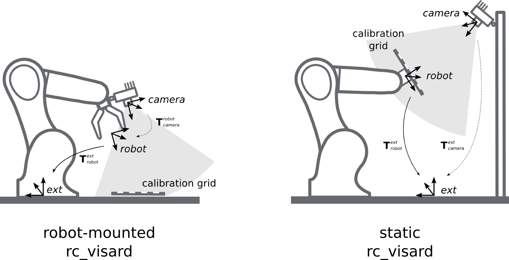
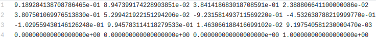

# Hand-Eye-Calibration-Matlab
# Camera to Arm Calibration

We improve [ZacharyTaylor'work](https://github.com/ZacharyTaylor/Camera-to-Arm-Calibration) which just calibrate camera to eye mounted a checkerboard to achieve the situation that the camera is mounted on the arm of robot.

## Introduction

### 1. Eye on Hand
A checkerboard is mounted on the end of the end effector. The corner points of this checkerboard can be robustly detected in the image. The location of its points can also be projected into the image using

**Where**  
 is a corner point on the checkerboard.  
 is the transformation from the robotic arms base to its end effector.  
 is the transformation from the camera to the robotic arms base, which is the goal we want.  
 is the transformation from the robotic arms end effector to the checkerboard.

The specific details are shown in the documentation '**Camera to Robot Arm Calibration.pdf**'.

### 2. Eye in Hand
When a checkerboard is mounted on the end of the end effector, we improve the above method. In contrast, the location of the detected points can also be projected into the image using

**Where**  
 is the inverse matrix of which is record into a file, such as files of the folder '**cal1117**' in folder '**examples**'.  
 is the transformation from the camera to the robotic arms end effector, which is the goal we want here.  
 is the transformation from the robotic arms base to the checkerboard.

## Use

To apply this work to two scenes as above, we recommend readers to refer to the [ZacharyTaylor's repository](https://github.com/ZacharyTaylor/Camera-to-Arm-Calibration) and the folder '**examples**'. Note that we record the transformation from the robotic arms base to its end effector as a transform matrix.

